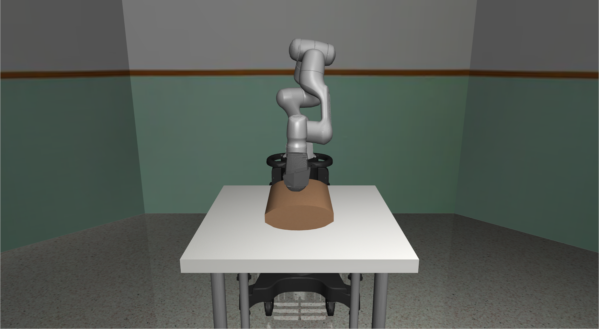
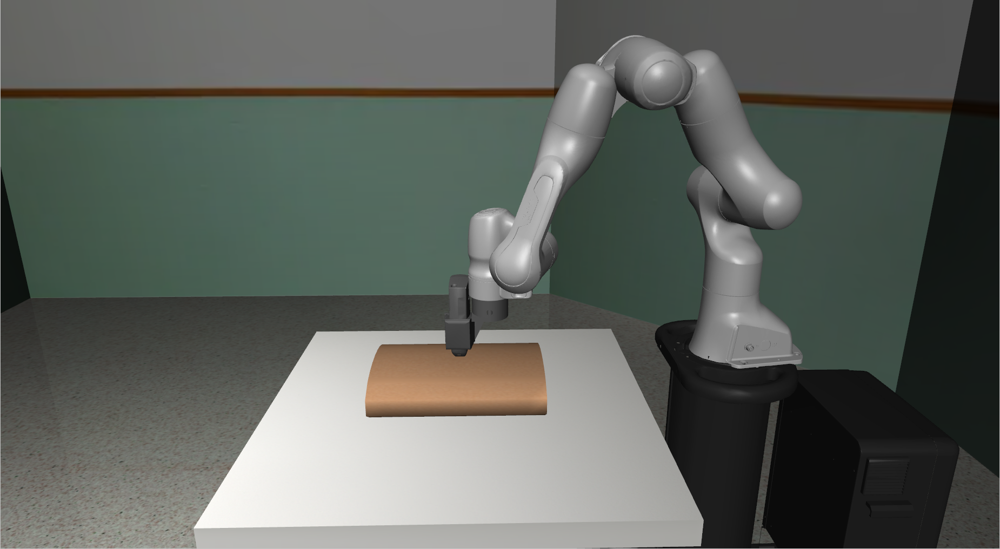
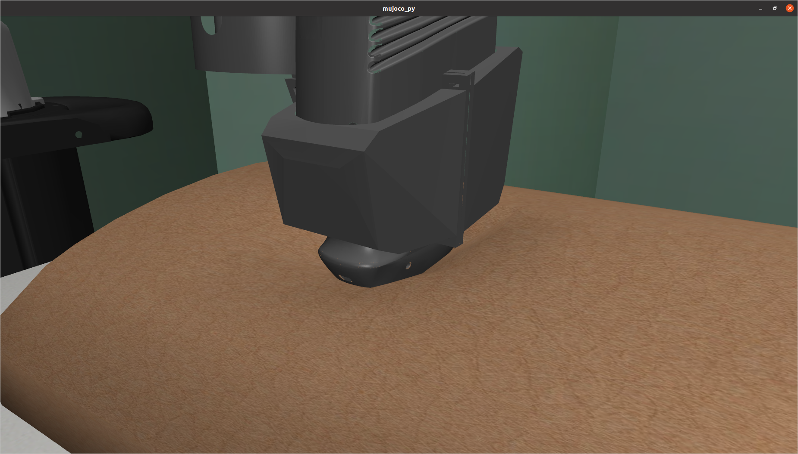
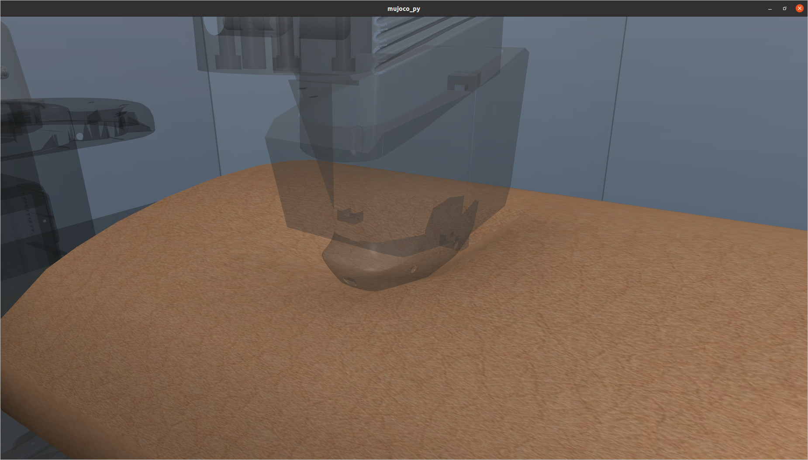

# Robotic ultrasound imaging
The overarching goal of this framework is to make a robot manipulator able to conduct automatic ultrasound imaging. 

As a first step, a simulation environment for experimenting with soft contacts has been created. Using reinforcement learning, the goal of the **ultrasound task** is to learn a robot how to perform a sweep across the surface of a soft body, while both exerting a desired force and keeping a constant velocity.  

<p align="middle">
  
   
</p>
<p align="middle">
  
   
</p>


# Installation 
The framework has been tested to run with Ubuntu20.04 and python3.8. 
## MuJoCo 2.0
Download [MuJoCo 2.0](https://www.roboti.us/index.html) and unzip its contents into `~/.mujoco/mujoco200`.  A license key can be obtained from [here](https://www.roboti.us/license.html). Copy your MuJoCo license key into `~/.mujoco/mjkey.txt`. The finalized folder structure should look like

```
~/.mujoco
│   mjkey.txt   
└───mujoco200
│   │   bin
│   │   doc
│   │   include
|   |   model
|   |   sample
```
Lastly, add the following line to the bottom of `~/.bashrc`
```
export LD_LIBRARY_PATH=$LD_LIBRARY_PATH:<path_to_home>/.mujoco/mujoco200/bin
```

## System dependencies
One of the Python packages, `mujoco-py`, has additional system dependencies. In order to install these dependencies, run the following:
```
sudo apt install libosmesa6-dev libgl1-mesa-glx libglfw3 patchelf
```
For further information, check out the `mujoco-py` [installation guide](https://github.com/openai/mujoco-py).

## Virtual environment
To avoid package conflicts, it is smart to create a virtual environment. It is possible to create a virtual environment using either pip or conda.

## Conda
First, follow the [guidelines](https://docs.conda.io/projects/conda/en/latest/user-guide/install/linux.html) on how to install Miniconda. The virtual environment can then be created by running 
```
conda env create -f conda.yaml
```
To activate the virtual environment, run 
```
conda activate rl_ultrasound
```

## Pip
Run the following command to set up a virtual environment
```
sudo apt install python-virtualenv

python3 -m venv venv
```
The virtual environment can be activated with
```
source venv/bin/activate
```
The required packages can then be installed with 
```
pip3 install wheel  
pip3 install -r requirements.txt
```

# Train and run an RL agent
It is possible to train an RL agent to perform the **ultrasound task**, where the framework has been integrated with the PPO algorithm from [stable-baselines](https://github.com/DLR-RM/stable-baselines3). Different settings (e.g. controller specifications) can be specified in `rl_config.yaml`. Note that the config file is not complete, so there exists numerous of other settings and hyperparameters that are not specifed in the file. For these parameters, the default values are used. 

To train (or run) an agent, it is as simple as running
```
python3 rl.py
``` 
Whether to train an agent, or evaluate a trained agent, is specified in `rl_config.yaml`.
